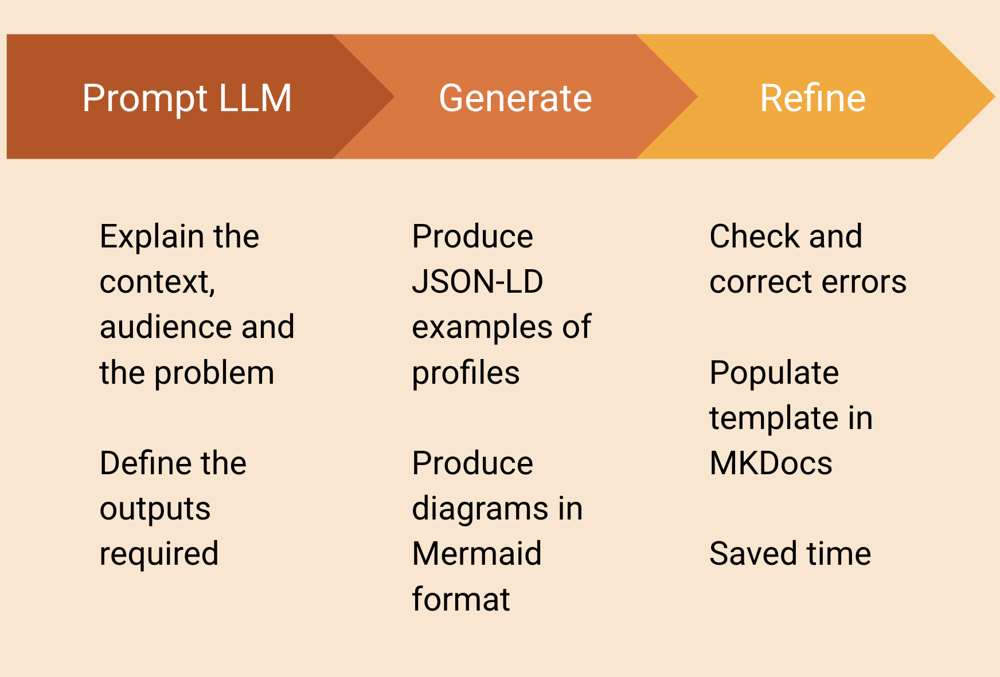
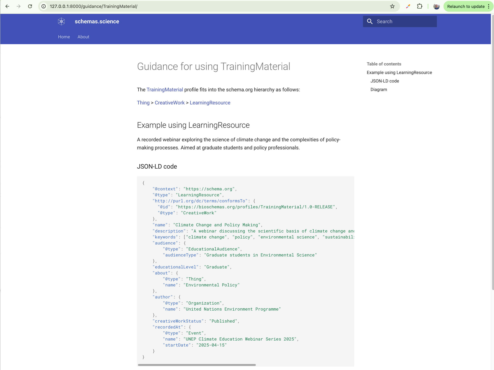
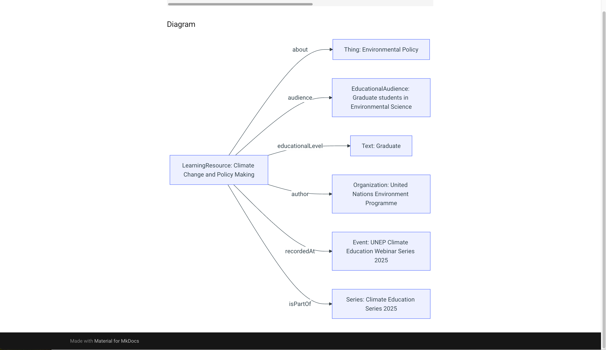

# Proposal for ISMB/ECCB 2025 CoFest

Proposal for [ISMB/ECCB 2025 CollaborationFest](https://www.open-bio.org/events/bosc-2025/ismb-collaborationfest-2025/): using genAI to co-create training materials for schemas.science

## Project title
Using genAI to co-create training materials for schemas.science

## Brief description of project
The project aims to develop a collection of user guides for profiles of schemas.science, assisted by an LLM. 

[schemas.science](https://schemas.science/) is a community effort which aims at improving the Findability on the Web of scientific research data, products and resources. 
It does this by encouraging the use of [Schema.org](https://schema.org/) markup in their websites so that they are indexable by search engines and other services. 
schemas.science encourages the consistent use of markup tailored for diverse scientific domains. 
This structured information then makes it easier to discover, collate, analyse and consume distributed resources.

The challenge is to create user guides for each profile, similar to the [Dataset guide from science-on-schema.org](https://github.com/ESIPFed/science-on-schema.org/blob/main/guides/Dataset.md). We propose the use of generative AI tools to assist the human and produce better guides, faster.

- In this work, the LLM is given a prompt to create realistic scientific examples of profiles such as [TrainingMaterial](https://schemas.science/profiles/TrainingMaterial/) and [ComputationalTool](https://schemas.science/profiles/ComputationalTool/). For example, it genereated a use of the TrainingMaterial profile as "A recorded webinar exploring the science of climate change and the complexities of policy-making processes. Aimed at graduate students and policy professionals."
- It generates JSON-LD code for these examples, generating and populating the mandoary properties and some of the recommended properties. 
- It generates a Mermaid diagram to visualise the structure.
- The human then checks the code is complete and valid, making necessary corrections. 
- The approved code is pasted into a template which is then used by a Jupyter notebook to produce Markdown files for the MkDocs engine to render.

Our current objectives are:

1. Extend the generated user guides to include more detail of each property.
2. Better automate the process of populating templates and Markdown files.
3. Better automate the process of prompting the LLM.
4. Publish the generated materials on the production site.
5. Document our method.

## Additional information 
This project follows on from the [BOSC & BOKR](https://www.iscb.org/ismbeccb2025/programme-agenda/scientific-programme/bosc) talk: "Applications of Bioschemas in FAIR, AI and knowledge representation" on Tuesday, 22 July, by Nick Juty, The University of Manchester, UK. A proof of concent was developed at a Bioschemas public hackathon at ZB MED, Cologne, Germany, in June 2025. See the [dev-docs branch](https://github.com/schemas-science/schemas-science.github.io/tree/dev-docs) for details.

The process 

Screenshot of the generated description and JSON-LD for a profile

Screenshot of the generated Mermaid diagram, rendered by an MkDocs plugin
